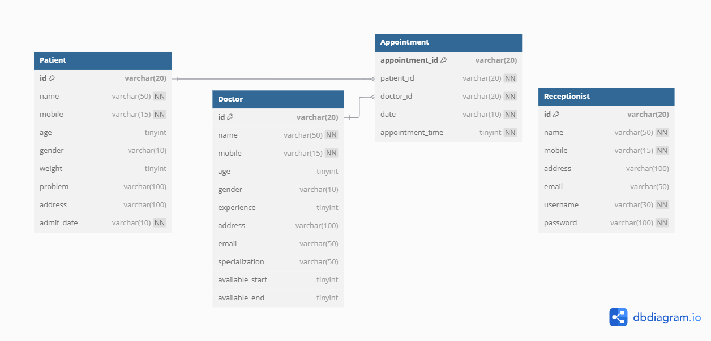

# CarePlus - Console Based Hospital Management System



## 📌 About the Project

**CarePlus** is a Java-based console application for managing basic hospital operations such as patient registration, doctor availability, appointment booking, and receptionist handling. It simulates a hospital environment where **Admins** and **Receptionists** have different access levels and responsibilities. This project follows **SOLID principles** and supports **JDBC integration with MySQL** for persistent data storage.

---

## 👤 User Roles

### ✅ Admin (The one & only)
- Add/Delete Receptionists
- Add Doctors
- Modify Doctors' available time (start and end)
- Manage Appointments
- View all Doctors, Receptionists, and Appointments
- **Login**: Admin credentials are hardcoded in the application

### ✅ Receptionist
- Add Doctors and Patients
- Manage Doctor Time
- Book Appointments (only if the doctor is available on given date & time)
- View all Doctors, Patients, and Appointments
- **Login**: Done via username and password stored in the database

---

## 🧩 Features

- 📋 Add & View Doctors, Patients, Receptionists
- ⏰ Manage Doctor Availability (Start & End Time)
- 🩺 Book Appointments after checking availability
- 🔐 Login System for Admin & Receptionist
- 💾 JDBC-based persistence with MySQL database
- 📂 (Tested) File Handling for backup (non-primary)
- ✅ Follows SOLID Principles

---

## 🛠️ Technologies Used

- Java (Console Application)
- JDBC
- MySQL
- File Handling (Java IO)
- Eclipse IDE

---

## 🗃️ Database Schema

The schema includes the following tables:

- `Doctor`
- `Patient`
- `Appointment`
- `Receptionist`

Each table is mapped to its respective POJO, and relationships like **foreign keys** (between `Appointment`, `Doctor`, and `Patient`) are properly enforced.

---

## ⚙️ How to Run

1. Clone the repository:
   ```bash
   git clone https://github.com/Mohamed-Kasali-Riswan/CarePlus-ConsoleApp.git
